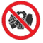
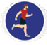
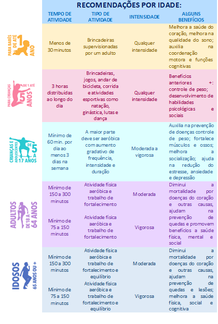
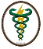

 

#  **O que é doença cardiovascular?**

 

A Organização Mundial da Saúde (OMS) considera as doenças cardiovasculares como parte de um grupo de doenças crônicas não transmissíveis (DCNT). Estima-se que 17,9 milhões de pessoas morreram por doenças cardiovasculares em 2016, representando 31% de todas as mortes em nível global. Destes óbitos, estima-se que 85% ocorrem devido a ataques cardíacos e acidentes vasculares cerebrais (AVCs).

 

#  **Quais as causas da doença cardiovascular?**

 

Os principais fatores de riscos são: 
 
- Tabagismo
 
- Uso abusivo do álcool
 
- Sedentarismo
 
- Hipertensão arterial Sistêmica 
 
- Colesterol alto
 
- Alimentação inadequada
 
- Obesidade
 
- Diabetes Mellitus

 

# **Orientações após a alta hospitalar**

 

	Cuidado	com	situações	de estresse!
 
	Evite longos períodos em jejum e tente comer de 3 em 3 horas;

 Precisamos de sal no organismo, mas em pouca quantidade (5 g/dia);

 Interrompa		o	consumo	de bebida		alcóolica,		cigarro, alimentos gordurosos e com alto teor	de		açúcar	(sorvetes, refrigerantes, etc);
 
 Não realize exercícios em jejum, use roupas adequadas para a prática dos exercícios. Pratique 150 minutos de exercícios semanais de intensidade leve/moderada (caminhada, exercício ativo livre, bicicleta, atividades em grupo);

Hidrate-se antes, durante e após os exercícios;

Faça acompanhamento com equipe	multidisciplinar (Cardiologista, Fisioterapeuta cardiovascular, Nutricionista);

 

#  **Orientação de atividade domiciliar**

 

- Exercícios aeróbicos (aquecimento, esteira ergométrica carga baixa, bicicleta ergométrica sem resistência, caminhada);
 
- Alongamentos gerais; 
 
- Exercícios para musculatura respiratória (inspiração máxima/expiração máxima);

 

 

#  **Quando procurar o serviço de urgência/emergência?**

 

Se sentir algum mal-estar como: dor no peito, procure imediatamente o pronto socorro mais próximio. Se você possui histórico familiar de doença coronariana, for diabético, fumante, obeso ou possuir colesterol alto, tenha ainda mais atenção.

 

#  **Equipe de Fisioterapia**

 

Ananda Rodrigues

[Email](mailto:anandaarievilo@icloud.com) | +55 95 98102-6848

 

Danielly Barreto

[Email](mailto:danielly.fisiorr@gmail.com) | +55 95 98112-4082

 

Dayanna Cristiny Castro

[Currículo Lattes](http://lattes.cnpq.br/7572713717592560) |
[Email](mailto:castrodayanna@yahoo.com.br) | +55 95 98100-5950

 

Gabriel Parisotto 

[Currículo Lattes](https://lattes.cnpq.br/7092814362835725) |  [Email](mailto:gabriel_parizoto@yahoo.com.br) | +55 95 98120-4162

 

Helouise Canavarro

[Currículo Lattes](http://lattes.cnpq.br/9578184749144795) |  [Email](mailto:helouisecs@gmail.com) | +55 95 99138-8319

 

Jessica Elmore

[Currículo Lattes](http://lattes.cnpq.br/5132354074892683) |  [Email](mailto:elmorevick@gmail.com) | +55 95 9903-1473

 

João Victor Carvalho Reis

[Currículo Lattes](http://lattes.cnpq.br/6590588285794581) |  [Email](mailto:victorcarvalhoreis@hotmail.com) | +55 95 98117-0587

 

Karolainy Mourão

[Email](mailto:mouraokarolainy@gmail.com) | +55 95 99112-3899

 

Kássia Regina

[Email](mailto:celsa_mateus@hotmail.com) | +55 95 99136-6022

 

Lidiellen Dionizio

[Email](mailto:lidiellenjdionizio@gmail.com) | +55 95 98106-3996

 

Lisandro Cerveira

[Currículo Lattes](http://lattes.cnpq.br/5430277146097344) |  [Email](mailto:gabriel_parizoto@yahoo.com.br) | +55 95 98120-4162

 

Lully Vieira

[Email](mailto:lullyvieira92@gmail.com) | +55 95 99103-2843

 

Nayrla Carvalho

[Currículo Lattes](http://lattes.cnpq.br/702351116861671)
[Email](mailto:cnayrla@gmail.com) | +55 95 99111-1507

 

Roniel Silva

[Email](mailto:roniel.silva21@gmail.com) | +55 95 99121-8978

 

Rosicléia Alves de Araújo

[Email](mailto:cleiaa3217@gmail.com) | +55 95 99111-1507

 

Thereza Cristina

[Email](mailto:therezacristina15@gmail.com) | +55 95 99161-8496

