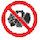

 

#  **O que são doenças cardiovasculares?**

 

As doenças crônicas não transmissivéis (DCNT) constituem o principal causa de morte em todo o mundo, sendo responsáveis por mortes prematuras, perda de qualidade de vida, além de adversos impactos econômicos e sociais.

As DCNT são divididas em doenças cardiovasculares (DCV), doenças do trato respiratório e neoplasias e são responsáveis por cerca de 70% das mortes globais, equivalendo a mais de 38 milhões de mortes por ano.^[Cardiovascular Statistics - Brazil 2021. Arq Bras Cardiol. 2022;118(1):115]

Cerca de 45% de todas as mortes por DCNT no mundo, mais de 17 milhões, são causadas por DCV. Distribuição similar é observada no Brasil, onde 72% das mortes resultam de DCNT, sendo 30% devido a DCV e 16% a neoplasias.^[Cardiovascular Statistics - Brazil 2021. Arq Bras Cardiol. 2022;118(1):115]

 

#  **Quais as causas da doença cardiovascular?**

 

- Tabagismo^[Précoma DB, de Oliveira GMM, Simão AF, Dutra OP, Coelho OR, Izar MC de O, et al. Updated cardiovascular prevention guideline of the Brazilian society of cardiology – 2019. Arq Bras Cardiol. 2019;113(4):787–891]

- Uso abusivo do álcool^[Précoma DB, de Oliveira GMM, Simão AF, Dutra OP, Coelho OR, Izar MC de O, et al. Updated cardiovascular prevention guideline of the Brazilian society of cardiology – 2019. Arq Bras Cardiol. 2019;113(4):787–891]

- Sedentarismo^[Précoma DB, de Oliveira GMM, Simão AF, Dutra OP, Coelho OR, Izar MC de O, et al. Updated cardiovascular prevention guideline of the Brazilian society of cardiology – 2019. Arq Bras Cardiol. 2019;113(4):787–891]

- Hipertensão arterial Sistêmica^[Précoma DB, de Oliveira GMM, Simão AF, Dutra OP, Coelho OR, Izar MC de O, et al. Updated cardiovascular prevention guideline of the Brazilian society of cardiology – 2019. Arq Bras Cardiol. 2019;113(4):787–891]

- Colesterol alto^[Précoma DB, de Oliveira GMM, Simão AF, Dutra OP, Coelho OR, Izar MC de O, et al. Updated cardiovascular prevention guideline of the Brazilian society of cardiology – 2019. Arq Bras Cardiol. 2019;113(4):787–891]

- Alimentação inadequada^[Précoma DB, de Oliveira GMM, Simão AF, Dutra OP, Coelho OR, Izar MC de O, et al. Updated cardiovascular prevention guideline of the Brazilian society of cardiology – 2019. Arq Bras Cardiol. 2019;113(4):787–891]

- Obesidade^[Précoma DB, de Oliveira GMM, Simão AF, Dutra OP, Coelho OR, Izar MC de O, et al. Updated cardiovascular prevention guideline of the Brazilian society of cardiology – 2019. Arq Bras Cardiol. 2019;113(4):787–891]

- Diabetes Mellitus^[Précoma DB, de Oliveira GMM, Simão AF, Dutra OP, Coelho OR, Izar MC de O, et al. Updated cardiovascular prevention guideline of the Brazilian society of cardiology – 2019. Arq Bras Cardiol. 2019;113(4):787–891]

 

# **Orientações após a alta hospitalar**

 

	Cuidado	com	situações	de estresse
 
	Evite longos períodos em jejum e tente comer de 3 em 3 horas

 Precisamos de sal no organismo, mas em pouca quantidade (Máximo 2 g/dia)^[Barroso WKS, Rodrigues CIS, Bortolotto LA, Mota-Gomes MA, Brandão AA, de Magalhães Feitosa AD, et al. Brazilian guidelines of hypertension - 2020. Arq Bras Cardiol. 2021;116(3):516–658]

 Interrompa o	consumo	de bebida		alcóolica, cigarro, alimentos gordurosos e com alto teor de	açúcar (sorvetes, refrigerantes, etc)

 Realize semanalmente 150 minutos de exercícios de intensidade leve/moderada (caminhada, exercício ativo livre, bicicleta, atividades em grupo)^[de Carvalho T, Milani M, Ferraz AS, da Silveira AD, Herdy AH, Hossri CAC, et al. Brazilian cardiovascular rehabilitation guideline – 2020. Arq Bras Cardiol. 2020;114(5):943–87]

 Hidrate-se antes, durante e após os exercícios. Em 2 a 4 horas antes do exercício aconselha-se o consumo de água equivalente a 5 a 10 mL/kg de peso corporal, durante o exercício recomenda-se a ingestão de 400 a 800 mL de água/hora de exercício e após o exercício a ingesta de ao menos 450 a 675 mL de líquido^[Panel E, Nda A. Scientific Opinion on Dietary Reference Values for water 1. 2010;8(3):1–48]

 Faça acompanhamento com equipe	multidisciplinar (Cardiologista, Fisioterapeuta cardiovascular, Nutricionista)

 

#  **Orientação de atividade domiciliar** 

 

- Exercícios aeróbicos (aquecimento, esteira ergométrica carga baixa, bicicleta ergométrica sem resistência, caminhada)^[Carvalho T de, Milani M, Ferraz AS, Silveira AD da, Herdy AH, Hossri CAC, et al. Diretriz Brasileira de Reabilitação Cardiovascular – 2020. Arq Bras Cardiol. 2020 May;114(5):943–87]

- Exercícios de treinamento para musculatura inspiratória (40 a 60 % da PIMax na alta hospitalar)^[Carvalho T de, Milani M, Ferraz AS, Silveira AD da, Herdy AH, Hossri CAC, et al. Diretriz Brasileira de Reabilitação Cardiovascular – 2020. Arq Bras Cardiol. 2020 May;114(5):943–87]

- Após receberem as instruções sobre a prescrição dos exercícios, os pacientes executam as sessões por conta própria, podendo haver documentação dos exercícios em planilhas impressas ou eletrônicas, com utilização de recursos como cardiofrequencímetros, pedômetros ou medidores de velocidade e distância percorrida por GPS. Aplicativos de smartphones podem intermediar a troca de informações entre os pacientes e a equipe assistencial.^[Carvalho T de, Milani M, Ferraz AS, Silveira AD da, Herdy AH, Hossri CAC, et al. Diretriz Brasileira de Reabilitação Cardiovascular – 2020. Arq Bras Cardiol. 2020 May;114(5):943–87]
                                            

 

#  **Quando procurar o serviço de urgência/emergência?**

 

- Se sentir algum mal-estar como: dor no peito, procure imediatamente o pronto socorro mais próximo

- Se você possui histórico familiar de doença coronariana, for diabético, fumante, obeso ou possuir colesterol alto, tenha ainda mais atenção.

 

#  **Equipe de Fisioterapia**

 

Ananda Rodrigues | [Email](mailto:anandaarievilo@icloud.com) | [Celular](tel:+55 95 98102-6848)

Danielly Barreto | [Email](mailto:danielly.fisiorr@gmail.com) | [Celular](tel:+55 95 98112-4082)

Dayanna Cristiny Castro |
[Email](mailto:castrodayanna@yahoo.com.br) | [Celular](tel:+55 95 98100-5950) | [Currículo Lattes](http://lattes.cnpq.br/7572713717592560)

Gabriel Parisotto |  [Email](mailto:gabriel_parizoto@yahoo.com.br) | [Celular](tel:+55 95 98120-4162) | [Currículo Lattes](https://lattes.cnpq.br/7092814362835725)

Helouise Canavarro|  [Email](mailto:helouisecs@gmail.com) | [Celular](tel:+55 95 99138-8319) | [Currículo Lattes](http://lattes.cnpq.br/9578184749144795)

Jessica Elmore |  [Email](mailto:elmorevick@gmail.com) | [Celular](tel:+55 95 9903-1473)  | [Currículo Lattes](http://lattes.cnpq.br/5132354074892683)

João Victor Carvalho Reis |  [Email](mailto:victorcarvalhoreis@hotmail.com) | [Celular](tel:+55 95 98117-0587) | [Currículo Lattes](http://lattes.cnpq.br/6590588285794581)

Karolainy Mourão | [Email](mailto:mouraokarolainy@gmail.com) | [Celular](tel:+55 95 99112-3899)

Kássia Regina | [Email](mailto:celsa_mateus@hotmail.com) | [Celular](tel:+55 95 99136-6022)

Lidiellen Dionizio | [Email](mailto:lidiellenjdionizio@gmail.com) | [Celular](tel:+55 95 98106-3996)

Lisandro Cerveira |  [Email](mailto:gabriel_parizoto@yahoo.com.br) | [Celular](tel:+55 95 98120-4162) | [Currículo Lattes](http://lattes.cnpq.br/5430277146097344)

Lully Vieira | [Email](mailto:lullyvieira92@gmail.com) | [Celular](tel:+55 95 99103-2843)

Nayrla Carvalho | [Email](mailto:cnayrla@gmail.com) | [Celular](tel:+55 95 99111-1507) | [Currículo Lattes](http://lattes.cnpq.br/702351116861671)

Roniel Silva | [Email](mailto:roniel.silva21@gmail.com) | [Celular](tel:+55 95 99121-8978)

Rosicléia Alves de Araújo | [Email](mailto:cleiaa3217@gmail.com) | [Celular](tel:+55 95 99111-1507)

Thereza Cristina | [Email](mailto:therezacristina15@gmail.com) | [Celular](tel:+55 95 99161-8496)

 
